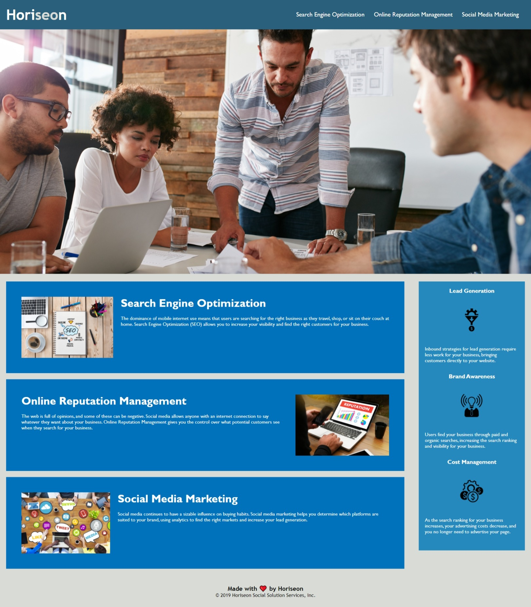

# CWRU Cooding Bootcamp Challenge 1
## PURPOSE: Refactor Code to meet accessibility standards so the site is optimized for search engines.

Open [index.html](./index.html) in your browser to view the updated landing page.
   - Source: [Github](https://github.com/awolrob/Challenge1)
   - Published Site: [Live URL](https://awolrob.github.io/Challenge1/)

## A marketing agency:
Wants a codebase that follows accessibility standards so the site is optimized for search engines

## Acceptance Criteria is as follows:

1. WHEN I view the source code
   THEN I find semantic HTML elements
- Action: Update and add semantic HTML elements if not present or incorrect
- Ref: https://www.w3schools.com/html/html5_semantic_elements.asp^
- Ref: https://www.w3schools.com/html/html_accessibility.asp

2. WHEN I view the structure of the HTML elements
   THEN I find that the elements follow a logical structure independent of styling and positioning
- Action: Update HTML format and flow to ensure a logical structure
- Ref: https://developer.mozilla.org/en-US/docs/Learn/HTML/Introduction_to_HTML/Document_and_website_structure
- Ref: https://www.w3docs.com/snippets/html/html5-page-structure.html
 

3. WHEN I view the image elements
   THEN I find accessible alt attributes
- Action: Review all images and add or update atl tags with accessibility readers in mind and so images become indexable by search engines
- Ref: https://www.w3.org/WAI/tutorials/images/
 

4. WHEN I view the heading attributes
   THEN they fall in sequential order
- Action: Review heading attributes update or change to ensure they fall in sequential order
- Ref: https://developer.mozilla.org/en-US/docs/Web/HTML/Element/Heading_Elements
- Ref: https://www.w3schools.com/html/html_headings.asp

5. WHEN I view the title element
   THEN I find a concise, descriptive title
- Action: Ensure title element has a  concise, descriptive title that describes the page's purpose for accessibility readers
- Ref: https://developer.mozilla.org/en-US/docs/Web/HTML/Element/title#accessibility_concerns

##### Additional Requirement
> Always leave the code you are editing a little cleaner than you found it.
* Rework the CSS to make it more efficient by consolidating CSS selectors and properties
-  Ref: https://developer.mozilla.org/en-US/docs/Learn/CSS/Building_blocks/Organizing

## Change log:
1 - Updated Title

2 - replaced div were semantic HTML elements exist

2.1 - header, nav, section for class=content, aside for class=benefits, footer

3 - Shift-Alt-F to reformt code - to easily ensure proper indention 

4 - Put loose hero div into a section

5 - update CSS to reapply formatting, styles to referece new semantic HTML elements in nav

6 - change h2 footer to h3 and updated CSS to reference h3 instead of h2

7 - fix broken link to "search-engine-optimization" by adding id=

8 - added blank line between sections in body for readibility

9 - added alt="" to visual decoration images to left aside section / benefits class

10 - decided to change divs in content section and aside section into article elements for readibility

11 - add aira lable to hero background image (Ref: https://www.davidmacd.com/blog/alternate-text-for-css-background-images.html)

12 - add alt text to content article images

13 - refactor h2 h3 img css

14 - update classes for content section and aside.  Remove unused selectors

15 - comment start and end CSS style sections

16 - review indentation and add white space in HTML and CSS for readibility

- - -

**Original page:**

 

- - -

**Updated page:** 

 

- - -
` https://github.com/awolrob | 2021-05-26 `  :+1: